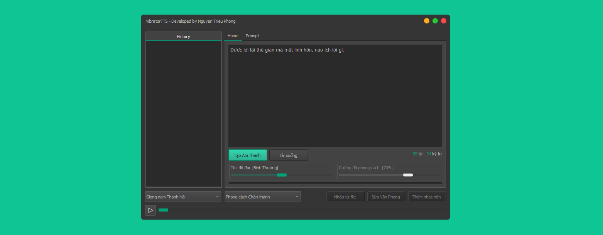

# VibratorTTS 🎙️

**VibratoTTS** là phần mềm tổng hợp giọng nói (Text-to-Speech) hiện đại, dễ sử dụng và linh hoạt. Ứng dụng hỗ trợ nhiều kiểu giọng, phong cách đọc, và điều chỉnh tốc độ, cảm xúc một cách tự nhiên — phục vụ tốt cho việc thuyết minh video, kể chuyện, học ngôn ngữ, và nhiều mục đích khác.

## ✨ Tính năng nổi bật

* ✍️ **Chuyển đổi Văn bản thành Giọng nói (TTS):** Nhập văn bản và chuyển đổi sang file âm thanh WAV.
* 🗣️ **Nhiều tùy chọn Giọng nói & Phong cách:** Lựa chọn từ danh sách các giọng đọc và phong cách được định nghĩa sẵn.
* 🛠️ **Tùy chỉnh Prompt Nâng cao:** Thêm, sửa, xóa các "prompt" (hướng dẫn chi tiết) để tinh chỉnh ngữ điệu, cảm xúc, nhịp điệu của giọng đọc.
* ⏩ **Điều chỉnh Tốc độ:** Thay đổi tốc độ đọc từ Rất chậm đến Rất nhanh thông qua thanh trượt.
* ▶️ **Phát lại Âm thanh:** Nghe lại file âm thanh đã tạo trực tiếp trong ứng dụng với các điều khiển Play/Pause và thanh trượt tiến trình.
* 📜 **Lịch sử Chuyển đổi:** Lưu danh sách các file âm thanh đã tạo gần đây, cho phép nghe lại nhanh chóng.
* 💾 **Tải xuống:** Lưu file âm thanh WAV đã tạo về máy tính.
* 🎨 **Giao diện Hiện đại:** Sử dụng theme tối và thiết kế cửa sổ không viền (frameless).
* 📊 **Phản hồi Trực quan:** Hiển thị thông báo trạng thái (thành công ✅, lỗi ❌, cảnh báo ⚠️) và thanh tiến trình khi chuyển đổi.
* 🔄 **Hoạt động Bất đồng bộ:** Quá trình gọi API và xử lý âm thanh chạy trên các luồng riêng biệt, đảm bảo giao diện luôn mượt mà.

## ⚙️ Cách hoạt động

1.  ⌨️ Người dùng nhập văn bản, chọn giọng đọc, phong cách và tốc độ.
2.  ✍️ Người dùng có thể tùy chỉnh các prompt hướng dẫn cho phong cách đã chọn.
3.  🎵 Ứng dụng lưu dữ liệu âm thanh thành file định dạng `.wav`.
4.  ⏯️ File âm thanh được phát và thêm vào danh sách lịch sử.
5.  📥 Người dùng có thể nghe lại hoặc tải file về.

## 🚀 Sử dụng

Chạy file `VibratoTTS.exe`. Giao diện ứng dụng sẽ xuất hiện. Thực hiện nhập văn bản và cấu hình các tùy chọn để bắt đầu chuyển đổi.

## 🔧 Cấu hình (Đối với phiên bản mã nguồn mở)

* 🗣️ **Giọng nói và Phong cách:** Các tùy chọn giọng nói và phong cách được định nghĩa trong file `config.py`.
* 🎶 **Âm thanh Giới thiệu:** Dữ liệu âm thanh giới thiệu được lưu trong `intro_bytes.py`.

## 🧑‍💻 Tác giả

* **Nguyễn Triệu Phong**
    * 📘 Facebook: [www.facebook.com/mrtrieuphong](https://www.facebook.com/mrtrieuphong)
    * 🌐 Blog: [www.nguyentrieuphong.com](https://www.nguyentrieuphong.com)
    * 🐙 Github: [www.github.com/mrtrieuphong](https://www.github.com/mrtrieuphong)
